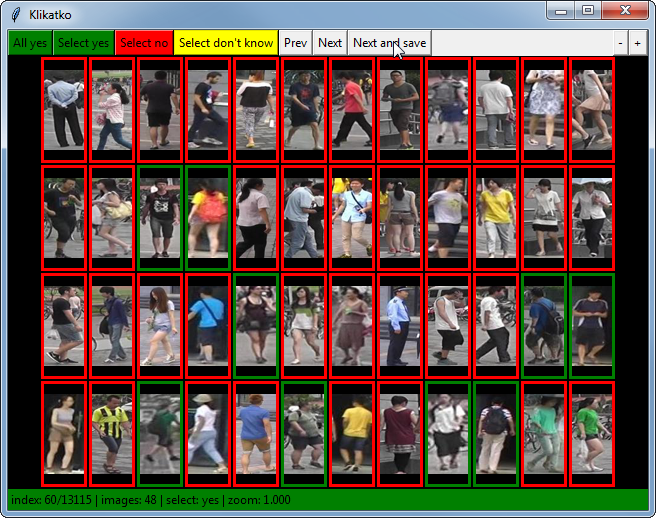

# Klikatko User Guide

Klikatko is a tool to annotate images into number of classes.



## Start the program

- Linux

```
$ bin/klikatko data/test.csv
$ bin/klikatko # Will show file open dialog
```

- Windows

```
$ python bin/klikatko
$ python bin/klikatko data/test.csv
```

## User interface


- Annotation area
    - the annotation area consist of images in a grid
    - each image has colored margin, the color represent the assigned class
    - when new set of images is show the default class is assigned to all images
    - when image is clicked it is assigned class which is being currently selected
- Annotation buttons
    - **All ok** -  mark all visible images as __ok__
    - **Select ok** - start marking __ok__ images (current mode is shown in the info bar)
    - **All bad** - mark all visible images as __bad__
    - **Select ok** - start marking __bad__ images (current mode is shown in the info bar)
    - **Prev** (`←`) - move to previous set of images (**does not store the annotations!**)
    - **Next** (`→`)- move to next set of set of images (**does not store the annotations!**)
    - **Next and save** (`↵`) - move to next set of image and **store the annotations**
- Zoom buttons
    - **+/-** - zoom in and zoom out (current zoom is shown in the infobar)
- Information line
    - The color of the bar shows the mode, when green the ok are being selected, when red the bad are being selected
    - **index** - index number of the first image
    - **images** - number of images in the set i.e. visible images
    - **select** - shows which class (ok, bad) are being selected
    - **zoom** - current zoom level
    - **last** - path to the last clicked image, is can be copied into clipboard using `C-c`
