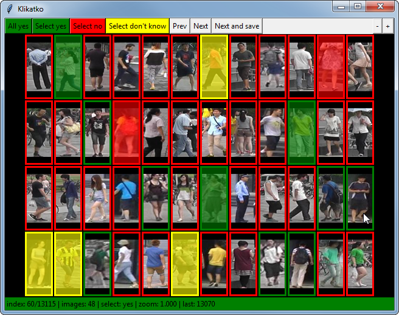

# Klikatko User Guide

Klikatko is a tool to annotate images into several classes. The user guide describes the basic idea of the program control.



<p align="center">
  
</p>

## Start the program

- Linux

```
$ bin/klikatko [options] <imfile> <attfile> <outfile>
```

- Windows (command window)

```
$ python bin\klikatko [options] <imfile> <attfile> <outfile>
```

## User interface


- Annotation area
    - the annotation area consists of images in a grid
    - each image has colored margin, the color represents the originally assigned class
    - when the image is clicked it is assigned class which is being currently selected
    - the class selected by the user is indicated by coloring the whole image with some transparency
    - the colors for classes are defined in the configuration file
- Annotation buttons
    - The annotation buttons are defined by configuration file
    - In our example, buttons for three clases annnotation are defined:
      - **All yes** -  mark all visible images as class 1
      - **Select yes** - start marking class 1 (current mode is shown in the info bar)
      - **Select no** - start marking class 2 (current mode is shown in the info bar)
      - **Select don't know** - start marking class 3 (current mode is shown in the info bar)
    - **Prev** (`←`) - move to previous set (page) of images (**does not store the annotations!**)
    - **Next** (`→`)- move to next set of set (page) of images (**does not store the annotations!**)
    - **Next and save** (`↵`) - move to next set (page) of image and **store the annotations**
- Zoom buttons
    - **+/-** - zoom in and zoom out (current zoom is shown in the information line)
- Information line
    - The color of the bar corresponds to the color of the class which is selected
    - **index** / **total number** - index of the first image and total number of images
    - **images** - number of images in the set i.e. visible images
    - **select** - shows which class are being selected
    - **zoom** - current zoom level
